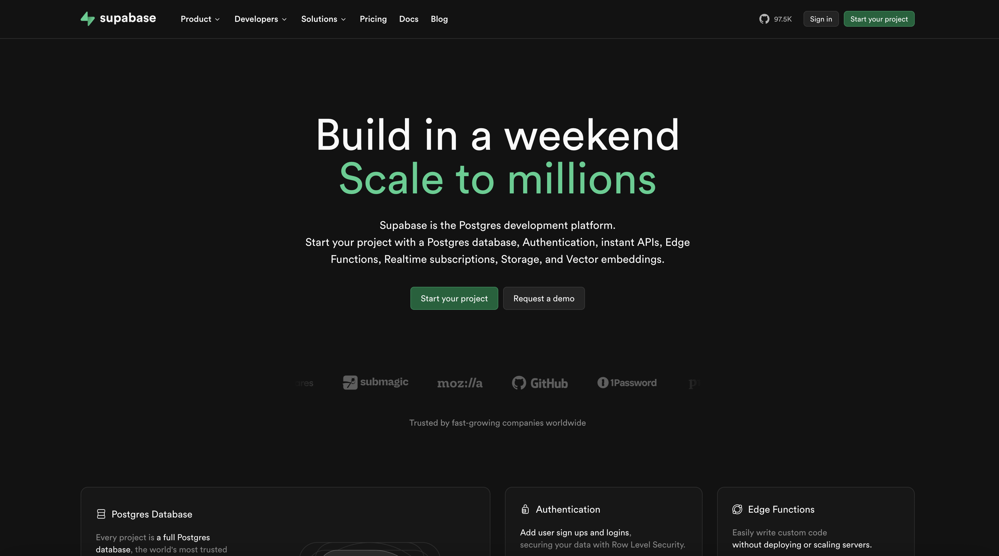
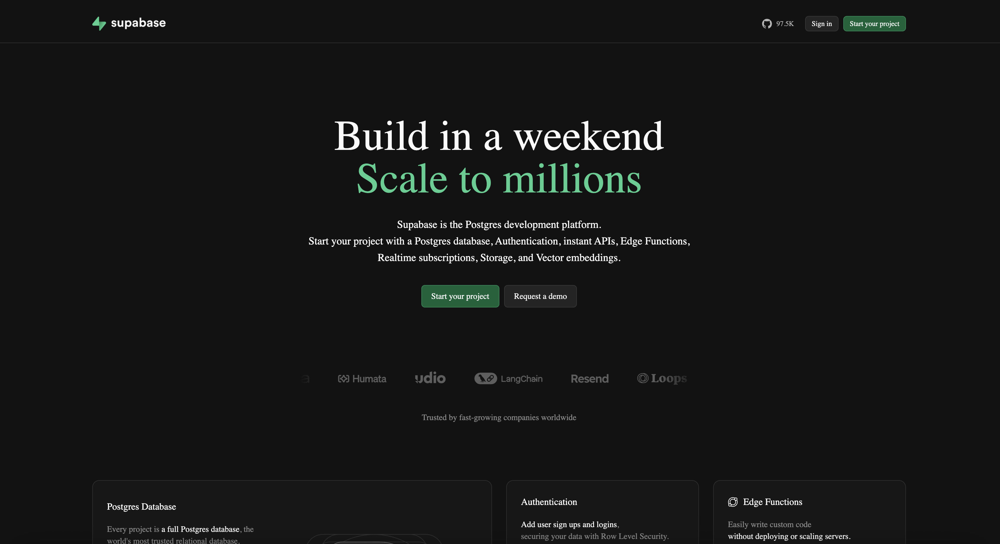

# design-memory

Extract and interpret design systems from websites using deterministic analysis and LLM interpretation.

| Real | Design Memory Output |
|------|---------------------|
|  |  |

## Installation

```bash
npm install -g design-memory

# Install Playwright browsers (required for crawling)
npx playwright install chromium
```

## Usage

```bash
# Learn a design system from a URL (requires OPENAI_API_KEY or --api-key)
design-memory learn <url>

# Learn from a screenshot or image
design-memory learn ./screenshot.png --from-image

# Multi-page: merge design from several URLs
design-memory learn <url> --pages <url2> <url3>

# Install design tokens into the current project
design-memory install

# Compare two design systems
design-memory diff <url-a> <url-b>

# Stubs: add, mix
design-memory add <package>
design-memory mix
```

See **[docs/CLI.md](docs/CLI.md)** for all options.

## Documentation

| Doc | Description |
|-----|--------------|
| [docs/README.md](docs/README.md) | Index of all documentation |
| [docs/HOW_IT_WORKS.md](docs/HOW_IT_WORKS.md) | How the pipeline and browser work |
| [docs/CLI.md](docs/CLI.md) | Full CLI reference |
| [docs/OUTPUT.md](docs/OUTPUT.md) | What's in .design-memory/ |
| [docs/ARCHITECTURE.md](docs/ARCHITECTURE.md) | Pipeline and modules |
| [TESTING_LOCALLY.md](TESTING_LOCALLY.md) | How to run tests |
| [IMPLEMENTATION.md](IMPLEMENTATION.md) | Implementation summary |

## Architecture

- **Acquire**: Playwright-based crawling and capture
- **Analyze**: Deterministic extraction of colors, typography, spacing, etc.
- **Interpret**: LLM-based semantic labeling and doctrine extraction
- **Project**: Generate `.design-memory/` folder with AI-optimized markdown files

## Development

```bash
npm install
npm run build
npm test
npm run check-loc  # Verify all files < 60 LOC
```
